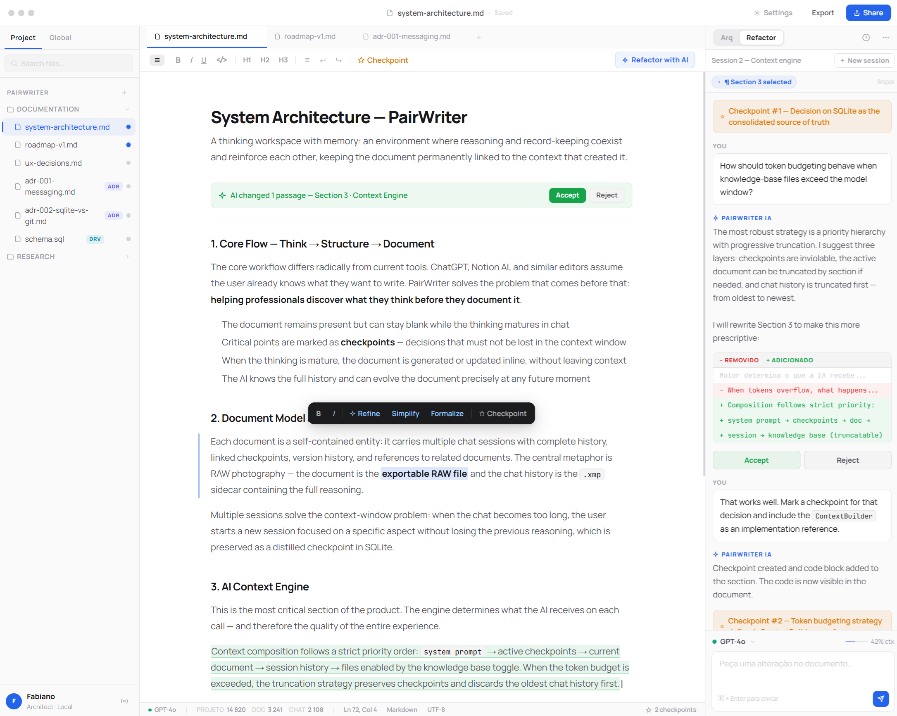

# Pair Writer

An AI-assisted thinking and writing workspace where chat, document, checkpoints, and memory evolve together.

## Why Pair Writer?

Most AI writing tools assume you already know what you want to write.
Pair Writer is built for the stage before that: thinking, structuring, refining, and only then documenting.

It connects:
- document editing
- chat-based reasoning
- checkpoints for key decisions
- persistent context across sessions
- project and global knowledge

## Core idea

Pair Writer treats the document as the central unit, but keeps the reasoning that produced it attached to the work.

Instead of separating “conversation” and “document”, Pair Writer keeps both connected:
- the document as the output
- the chat as the thinking trail
- checkpoints as preserved decisions
- memory as recoverable context

## Product direction

Current product direction includes:
- Tauri desktop app
- React frontend
- .NET 10 backend/API
- AI provider abstraction compatible with OpenAI-style APIs
- persistent local/project context
- document versioning and contextual recall

## Concept preview

This repository includes an early visual concept that illustrates the intended experience.

See also:
- `docs/concepts/pairwriter-concept.html`

## Status

Early concept / architecture phase.

## Goals

- Help users think before writing
- Preserve important reasoning, not only final output
- Allow AI-assisted refinement without losing document context
- Make long-form technical and strategic writing feel native

## Planned capabilities

- document-centered chat sessions
- checkpoint system
- contextual memory
- knowledge toggles per file
- inline AI refactor actions
- version-aware writing workflow

## License

TBD